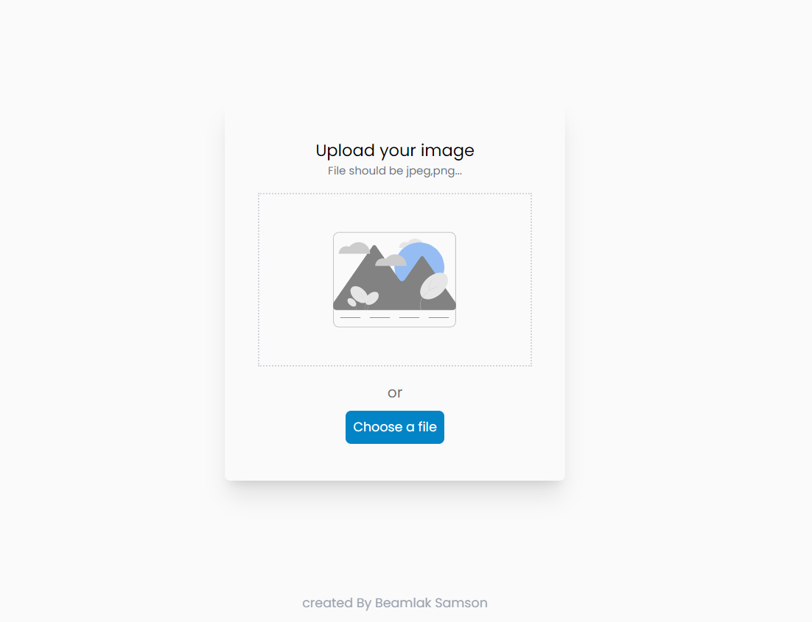

<h1 align="center">Image uploader</h1>

<div align="center">
   Solution for a challenge from  <a href="http://devchallenges.io" target="_blank">Devchallenges.io</a>.
</div>

<div align="center">
  <h3>
    <a href="https://image-uploader-client-one.vercel.app" target="_blank">
      Demo
    </a>
    <span> | </span>
    <a href="https://devchallenges.io/solutions/fP9B5ifAT12l5bgInktm" target="_blank">
      Solution
    </a>
    <span> | </span>
    <a href="https://devchallenges.io/challenges/O2iGT9yBd6xZBrOcVirx" target="_blank">
      Challenge
    </a>
  </h3>
</div>

<!-- TABLE OF CONTENTS -->

## Table of Contents

- [Overview](#overview)
- [Installation](#installation)
- [Built With](#built-with)
- [Features](#features)
- [Acknowledgements](#acknowledgements)


<!-- OVERVIEW -->

## Overview



#### Installation:

1. Clone the repository:

   ```bash
   git clone https://github.com/render217/Image-Uploader
   ```

2. Navigate into the directory and install dependencies: both in client and api folder

   ```bash
   npm install
   ```

3. Start the development server:
   ```bash
   npm run dev
   ```

### Built With

<!-- This section should list any major frameworks that you built your project using. Here are a few examples.-->

- **React** 
- **Tailwind**
- **Express**


## Features

<!-- List the features of your application or follow the template. Don't share the figma file here :) -->

This application/site was created as a submission to a [DevChallenges](https://devchallenges.io/challenges) challenge. The [challenge](https://devchallenges.io/challenges/wBunSb7FPrIepJZAg0sY) was to build an application to complete the given user stories.

- User story: I can drag and drop an image to upload it
- User story: I can choose to select an image from my folder
- User story: I can see a loader when uploading
- User story: When the image is uploaded, I can see the image and copy it
- User story: I can choose to copy to the clipboard


## Acknowledgements
- [Vercel](https://vercel.com/) - For frontend deployment
- [Render](https://render.com) - For backend deployment
- [fontawesome](https://fontawesome.com)
- [Cloudinary](https://cloudinary.com) - For image upload
